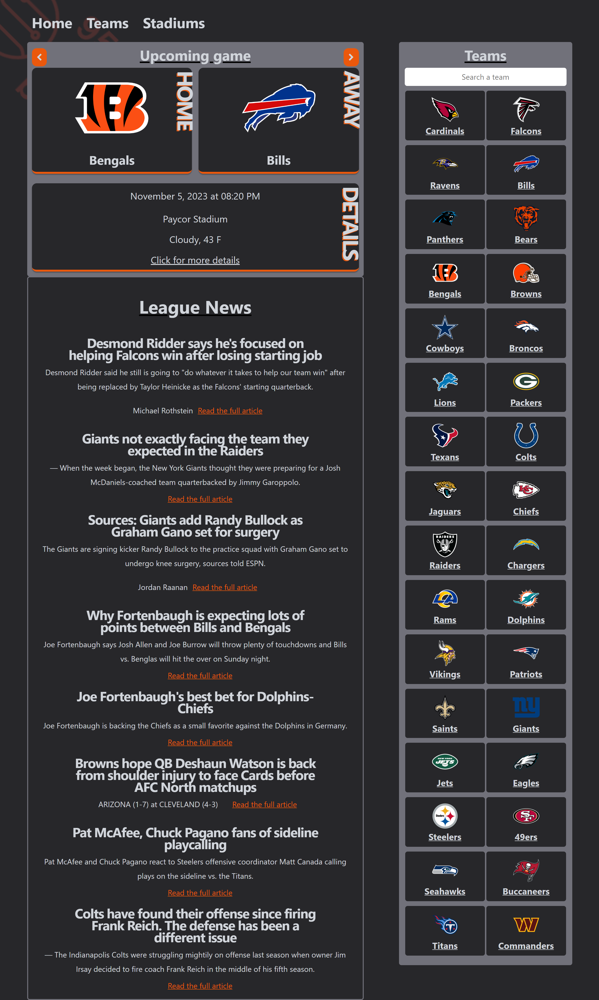
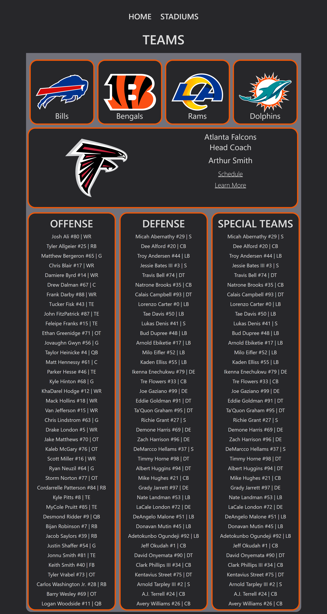
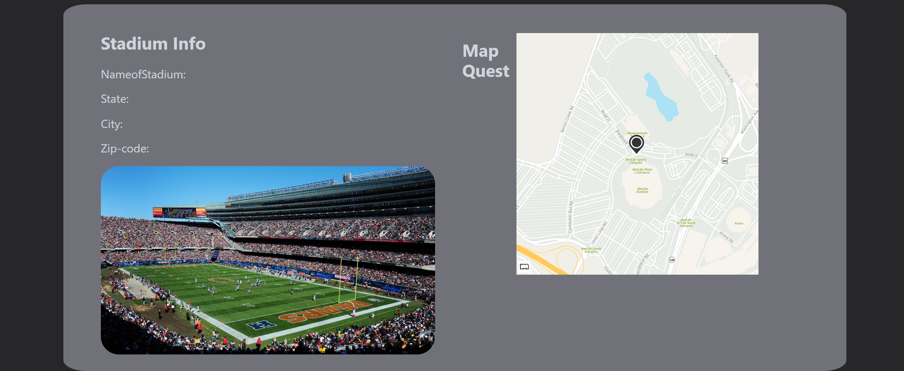

# Project HTML Files and JavaScript Code

Welcome to the repository containing HTML files and JavaScript code for an engaging web project centered around NFL statistics and teams. This project is thoughtfully organized into three HTML files, each serving a distinct purpose, along with JavaScript code that powers the web application's functionality.

## Table of Contents
- [Screenshots](#screenshots)
- [HTML Files](#html-files)
   - [index.html](#indexhtml)
   - [teams.html](#teamshtml)
   - [stadiums.html](#stadiumshtml)
- [JavaScript Code](#javascript-code)
- [Contributors](#contributors)

## Links
- Repo: https://github.com/CharlesWGillespie/95-96-Bulls-NFL-Stats-and-GeoLocator
- Live page: https://charleswgillespie.github.io/95-96-Bulls-NFL-Stats-and-GeoLocator

## Screenshots

## Apis used
Sports API: https://gist.github.com/nntrn/ee26cb2a0716de0947a0a4e9a157bc1c
MapQuest: https://developer.mapquest.com/documentation/

## HTML Files

### index.html

The home page of the web project includes sections for upcoming games, league news, and teams. Key sections on this page include:

- **Upcoming Game Section**: Displays information about an upcoming NFL game, including teams, event date and time, stadium, forecast, and a link to learn more about the game.

- **League News Section**: Provides a space for displaying league news.

- **Teams Section**: Allows users to explore information about NFL teams and includes a search feature to find specific teams.

### teams.html

The teams page provides information about NFL teams. The main sections on this page are:

- **Suggested Teams**: Displays suggested NFL teams with their respective images. Users can click on these teams to access more detailed information.

- **Team Information Section**: Shows detailed data for a selected NFL team, including the team logo, name, head coach, schedule link, and a "Learn More" link.

- **Starting Roster Sections**: Displays the team's offense, defense, and special teams roster, including player names, jersey numbers, and positions.

### stadiums.html

The stadiums page presents information about NFL stadiums. It comprises the following sections:

- **Search Bar**: Allows users to search for specific stadiums.

- **Suggested Stadiums**: Shows suggested NFL stadiums with their respective images.

- **Stadium Information Section**: Presents detailed data for a selected stadium, including the stadium name, state, city, zip code, and an image of the stadium.

- **Map Quest Section**: Displays a map or image related to the stadium's location.

## JavaScript Code

The JavaScript code included in this repository powers the functionality of the web application. It is responsible for fetching data from external sources, such as sports and news APIs, and displaying that data in the HTML pages. Key functionalities and features of the code include:

- Fetching and displaying data for upcoming NFL games.
- Fetching and displaying data for NFL teams, including logos, schedules, and rosters.
- Providing search functionality for finding specific NFL teams.
- Fetching and displaying NFL news articles.
- Handling user interactions such as navigating to previous and next games.
- Generating suggested teams and fetching team-specific data based on user input.

The JavaScript code is the backbone of this web project, making it dynamic and interactive. It serves as a comprehensive resource for NFL enthusiasts, offering an immersive platform to explore information about teams, stadiums, and upcoming games.

Feel free to explore the HTML files and JavaScript code, and adapt them to your specific project requirements. This repository is a valuable starting point for creating an engaging web application focused on NFL statistics and teams.

## Contributors

### Will
- GitHub Link: https://github.com/CharlesWGillespie
### Robert
- GitHub Link: https://github.com/rtotten46
### Evan
- GitHub Link: https://github.com/Evan8383